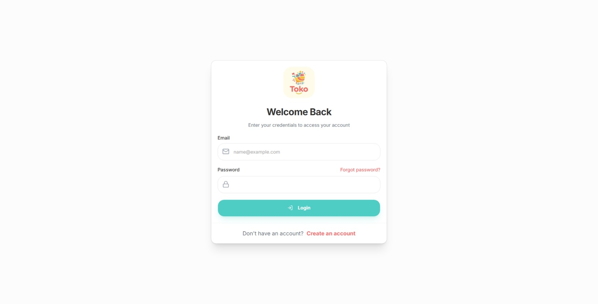
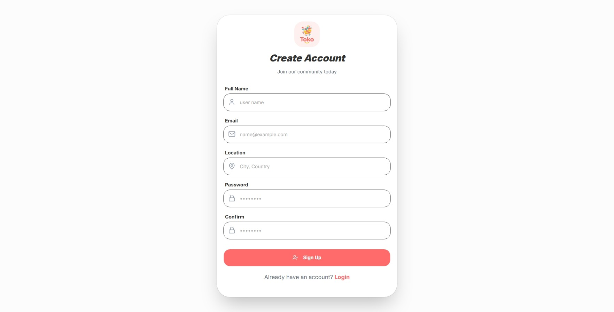

<div align="center">


# 🛍️ Toko E-Commerce Store

Modern React E-Commerce Application with Authentication, Dark Mode, and Multi-language Support.

[🌐 Live Demo](https://toko-87r.pages.dev)


</div>

---

# ✨ Features

- 🌍 Multi-language Support (Arabic / English)
- 🌙 Dark Mode Support
- 🔐 Authentication System (Login / Register / Forgot Password)
- 📍 Location Selection in Register
- 🛡️ Form Validation using Zod + React Hook Form
- ⚡ Fast Performance using Vite
- 🧠 State Management using Zustand
- 🎨 Modern UI using TailwindCSS + shadcn/ui

---

# 📸 Screenshots

## Login Page


## Register Page


---

# 🛠️ Tech Stack

### Frontend
- React.js
- Vite

### Styling
- TailwindCSS
- shadcn/ui

### State Management
- Zustand

### Form Validation
- React Hook Form
- Zod

### Deployment
- Cloudflare Pages

---

# 🚀 Getting Started

## Clone Repository

```bash
git clone https://github.com/mernaelnshar/Toko.git
```

## Install Dependencies

```bash
npm install
```

## Run Project

```bash
npm run dev
```

---

# 🌐 Live Demo

https://toko-87r.pages.dev

---

# 🎯 Future Improvements

- Add Cart functionality
- Add Product Pages
- Add Payment Integration
- Add User Dashboard

---

# 👩‍💻 

**Merna El-Nshar**

- GitHub: https://github.com/mernaelnshar

---

# ⭐ Support

If you like this project, please give it a ⭐ on GitHub!

---

<div align="center">

Made with ❤️ by Merna El-Nshar

</div>
